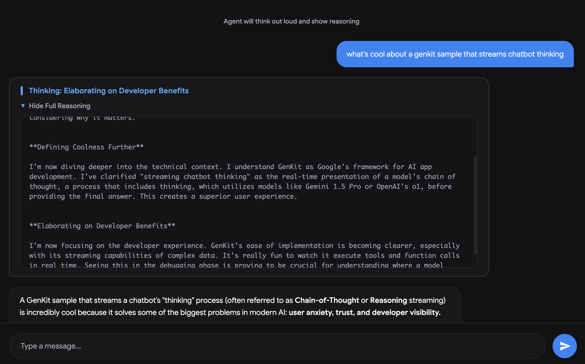

# Agent Streaming Chat Sample

This sample demonstrates a chatbot application that uses [Genkit](https://genkit.dev/) with Gemini 3.5 Flash to stream the AI's step-by-step thinking process (reasoning) alongside the final generated text response.



The Genkit code for the streaming flow can be found in `src/server/index.js`.

## How it works

- **Backend (Express):** Exposes an endpoint `/api/chat` using Server-Sent Events (SSE). It invokes the Genkit flow `streamingThoughtsFlow`, which streams both intermediate thoughts and the final text chunks.
- **Genkit Flow:** Uses `googleAI.model('gemini-3.5-flash')` with `thinkingConfig` (`includeThoughts: true`) to stream reasoning details. The flow yields custom chunk objects with `type: 'thought'` or `type: 'text'`.
- **Frontend (Vanilla JS):** Reads the Server-Sent Events stream, updates a collapsible "Thinking" card with step labels, and renders the model's Markdown text in real-time.

## Running the app

To run the app, follow these steps:

1.  **Install dependencies:**
    ```bash
    npm i
    ```

2.  **Configure your environment:**
    Create a `.env` file in the root of the `agent-streaming` directory and add your Gemini API key:
    ```env
    GEMINI_API_KEY="your-api-key"
    ```

### a) Running in development

To run the app with hot reloading for development:

1.  **Start the backend server** in one terminal:
    ```bash
    npm run dev:server
    ```

2.  **Start the frontend Vite server** in a second terminal:
    ```bash
    npm run dev:client
    ```

3.  **Open the application:**
    Open your browser and navigate to `http://localhost:5173`.

### b) Running in production

To run the app in production:

1.  **Build the client application:**
    ```bash
    npm run build
    ```

2.  **Start the production server:**
    ```bash
    npm start
    ```

3.  **Open the application:**
    Open your browser and navigate to `http://localhost:3000`.
